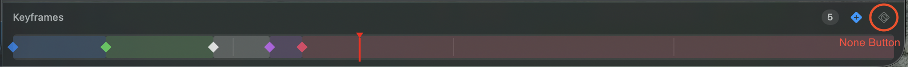

# Cropaway

A fast, native macOS app for cropping videos and saving crop data.


## Recent changes



- ### Keyframe Timeline Enhancements
    - **Color-coded keyframe spans** - Timeline now shows colored spans indicating each keyframe's active duration until the next keyframe
    - **"None" keyframe type** - Add keyframes that disable the bounding box for a duration (shown in white on the timeline)
    - **Update keyframe button** - New button to update the selected keyframe with the current bounding box; disabled when no changes pending
    - **Keyframe bar open by default** - Timeline is now visible by default when loading a video


## Features

- **Rectangle Crop** - Precise rectangular cropping with draggable handles
- **Circle Crop** - Circular masks with adjustable center and radius
- **Freehand Mask** - NLE-style point-based mask tool with bezier curves
- **AI Track (SAM3)** - Object tracking via fal.ai SAM3; text or point prompt, auto keyframes
- **Keyframe Animation** - Animate crop changes over time
- **Hardware Accelerated** - Uses VideoToolbox for fast ProRes/H.264/HEVC encoding
- **Batch Export** - Export multiple videos at once
- **Bounding Box Export** - Per-frame [x1, y1, x2, y2] to JSON
- **Lossless When Possible** - Stream copies when no crop changes needed

## Keyboard Shortcuts

| Action | Shortcut |
|--------|----------|
| Rectangle Mode | `Cmd + 1` |
| Circle Mode | `Cmd + 2` |
| Freehand Mode | `Cmd + 3` |
| AI Track (SAM3) | `Cmd + 4` |
| Export | `Cmd + E` |
| Export All Selected | `Cmd + Shift + E` |
| Play/Pause | `Space` |
| Step Forward | `→` |
| Step Backward | `←` |
| J/K/L Shuttle | `J` / `K` / `L` |
| Add Keyframe | `Cmd + K` |
| Undo | `Cmd + Z` |
| Redo | `Cmd + Shift + Z` |

## Requirements

- macOS 14.0 (Sonoma) or later
- Apple Silicon or Intel Mac

## Installation

Download the latest DMG from [Releases](../../releases/latest).

## Building from Source

```bash
# Clone the repository
git clone https://github.com/mhadifilms/cropaway.git
cd cropaway

# Build release
xcodebuild -scheme Cropaway -configuration Release build

# Or create DMG
./scripts/build-dmg.sh 1.0.0
```

## Tech Stack

- SwiftUI for the interface
- AVFoundation for video playback
- FFmpeg (bundled) for export with VideoToolbox hardware acceleration
- fal.ai SAM3 for AI object tracking
- Core Graphics for mask rendering

## License

MIT License - see [LICENSE](LICENSE) for details.
